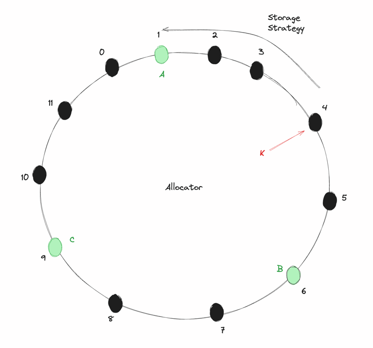

# CHRRRRR
A toy consistent hashing project in rust.
<hr>

## Introduction
This is a standard [consistent hashing](https://highscalability.com/consistent-hashing-algorithm/) implementation, where you'll be spinning up a new allocator and storage nodes across
a hash space. If you add / remove a new storage node, only `K/n` migrations needs to happen on an average where `K` being the 
number of keys and `n` being the number of nodes.

Why? because I was bored af and other rust projects were kinda standard.

## Consistent hashing scheme
We store the keys in anti clockwise direction. If a key is placed on `4` on the hashspace, we'll be storing it in nearest 
smallest hash allocated (in the image, it's on slot `1` in node `A`)



This storage strategy currently **does not** have virtual nodes, so replication and hot-nodes would be an issue in `v0.1.0`

## How to use?

#### 1. Building executable
```cmd
$ cargo build
```

#### 1. Running allocator server
```cmd
$ RUST_LOG=chrrrrrr=debug ./target/debug/chrrrrrr --mode a
```
Kindly note: Default port for server is `:3030`

#### 2a. Running a storage node
```cmd
$ RUST_LOG=chrrrrrr=debug ./target/debug/chrrrrrr --mode n --port 3031
```

#### 2b. Running new storage nodes?
```cmd
$ RUST_LOG=chrrrrrr=debug ./target/debug/chrrrrrr --mode n --port <your_port>
```

#### 3. Inserting key value pairs.
```curl
curl --location --request POST 'http://localhost:3030/insert' \
--header 'Content-Type: application/json' \
--data-raw '{
    "key": "{your_key}",
    "value": "{your_value}"
}'
```
#### 4. Getting the key 
```curl
curl --location --request GET 'http://localhost:3030/get/{your_key}'
}'
```
Note: you can add new storage nodes any time you want, allocator will take care of migrating the keys to new nodes.

## In dev pipeline
1. Build a demo script
2. Background thread to see if nodes are still responsive and dequeue accordingly.
3. Implementing virtual nodes.

## Alternatives
I saw [conhash-rs](https://github.com/zonyitoo/conhash-rs) being a package for consistent hashing, probably much more
convenient than spinning up new servers by self.